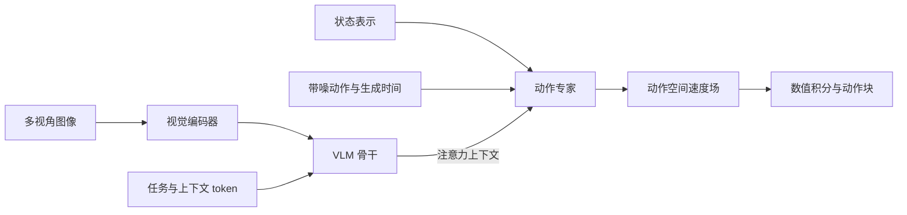
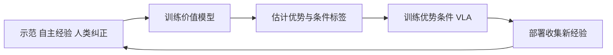
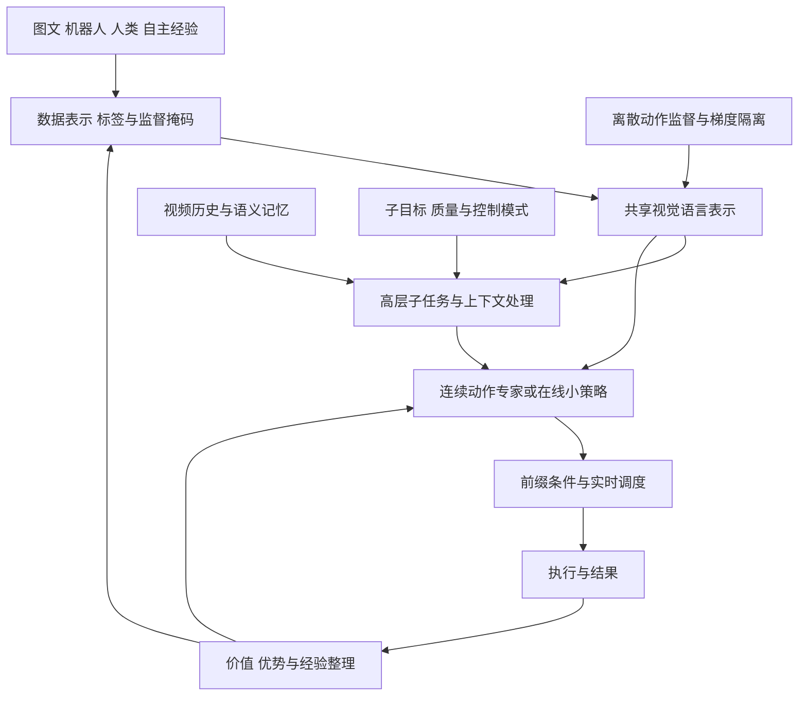

# PI 系列技术解读

对于具身智能这个行业来说，不得不提到一个公司，那就是大名鼎鼎的[Physical Intelligence](https://www.pi.website/)，简称[PI](https://www.pi.website/)。这个公司所做的一些工作探索和模型路径，算是具身智能浪潮下的一个缩影，从一开始的大语言模型的注入，将连续动作和视觉语言理解连接起来，到解决数据可用性、任务泛化性，最后研究如何提高学习能力、如何涌现智能，PI公司都做了大大小小很多探索。论文、实机实验与部分开源实现，让这些问题有了可检验、可借鉴的具体方案。

所以我觉得，对于一个刚刚入局或者正在接触具身智能的学习者来说，完整清晰、有脉络性的理解PI公司的系列工作是一件非常有必要的事情。基于此，我向大家分享我关于此的总结和心得。

## 目录

- [前置知识：模型怎样学习，不同训练方式怎样分工](#前置知识模型怎样学习不同训练方式怎样分工)
- [一、整体逻辑：策略的表示、条件、参数与执行如何共同演进](#一整体逻辑策略的表示条件参数与执行如何共同演进)
- [二、架构与动作表示：连续生成和离散学习如何形成分工](#二架构与动作表示连续生成和离散学习如何形成分工)
- [三、训练组织：多种监督怎样进入共享模型](#三训练组织多种监督怎样进入共享模型)
- [四、条件组织：层级、记忆与目标怎样共同决定动作](#四条件组织层级记忆与目标怎样共同决定动作)
- [五、经验学习：从拟合行为到区分质量和优化策略](#五经验学习从拟合行为到区分质量和优化策略)
- [六、执行机制：动作生成怎样适应真实时间](#六执行机制动作生成怎样适应真实时间)
- [七、源码贯通：从数据配置到控制接口](#七源码贯通从数据配置到控制接口)
- [八、综合判断：技术联系、实验证据与未解决问题](#八综合判断技术联系实验证据与未解决问题)

## 前置知识：模型怎样学习，不同训练方式怎样分工

### 1. 大量权重为什么能学到任务能力

权重决定输入经过怎样的计算得到输出。训练用数据提供目标，用损失衡量预测偏差，再通过反向传播和优化器调整权重。大量样本反复参与更新，模型逐渐学到观测、语言与动作之间可以复用的关系。

**参数量提供表达能力，数据提供学习依据，训练目标决定优化方向。** 参数更多，通常能表达更复杂的关系，但最终效果还取决于数据覆盖、模型结构和优化。训练集上学得好、未见数据上表现差，就是过拟合；新输入上仍然有效，才体现泛化。

机器人还多了一层闭环：动作会改变环境，也会改变下一次观测。因此，预测损失降低有助于改善行为，任务成功率仍要通过完整执行来检验。

### 2. 预训练、后训练和微调怎样分工

π0 接入动作之前，视觉语言骨干已经通过图文训练形成了可复用的表示；接入动作之后，再用机器人数据建立观测与控制之间的联系。这两层学习分别提供视觉语言基础和机器人行为基础。

- **预训练（Pre-training）**：面向较广的数据和任务，建立可迁移的基础能力。机器人预训练也可以使用示范动作监督。
- **持续预训练（Continued Pre-training）**：在已有权重上继续扩展基础数据覆盖，补充领域知识或适应新分布。
- **后训练（Post-training）**：在基础模型上改善使用效果，包括平台适配、任务熟练度、可靠性和效率；可以使用模仿学习，也可以使用强化学习。
- **微调（Fine-tuning）**：从已有权重出发继续优化，常用于后训练。监督微调 SFT 使用输入与目标输出的配对数据；全参数微调、局部微调和 LoRA 则描述不同的参数更新方式。

这些名称关注的角度不同：预训练与后训练描述训练的定位，模仿学习与强化学习描述学习信号，冻结或微调描述参数怎样改变。提示词、记忆和目标图像通过输入影响行为，在没有额外优化步骤时不会更新权重。

### 3. VLA 为什么使用模仿学习与强化学习

视觉语言模型已有的语义知识，还需要与机器人动作对应起来。**模仿学习 IL（Imitation Learning）用示范提供这种联系**：模型读取观测、指令和对应动作，学会生成可执行行为。其中，行为克隆 BC 将动作学习作为监督预测。π0 的流匹配、FAST 的离散 token 预测，都可以用于学习示范动作；它们描述的是动作怎样表示和生成。

策略开始自主执行后，会进入示范没有充分覆盖的状态，也会产生不同质量的结果。补充人类纠正与恢复数据，可以继续改善模仿学习；**强化学习 RL（Reinforcement Learning）则根据奖励和累计回报改进策略**，让成功、耗时与失败代价参与优化。价值估计评价后续结果，优势估计判断当前行为相对参考策略是否更好。

两者可以配合：示范提供基础策略，执行经验提供继续改进的依据。RECAP 把价值评价转成优势条件，RLT 将在线更新集中到小策略，π0.7 再吸收包括 RL 专家轨迹在内的多种经验。仅靠模仿学习也可以形成有效 VLA；是否加入强化学习，取决于能力缺口、奖励质量和交互成本。

离线学习使用已有数据，在线学习持续收集当前策略的经验。这个区别与预训练、后训练的阶段划分相互独立。具体训练目标、价值公式和参数更新路径，在后面的架构、经验学习与源码章节展开。

基础原理参考：[《动手学深度学习》：多层感知机](https://zh.d2l.ai/chapter_multilayer-perceptrons/mlp.html)、[模型选择、欠拟合和过拟合](https://zh.d2l.ai/chapter_multilayer-perceptrons/underfit-overfit.html)、[Sutton 与 Barto《Reinforcement Learning: An Introduction》第 3 章](http://incompleteideas.net/book/the-book-2nd.html)。

## 一、整体逻辑：策略的表示、条件、参数与执行如何共同演进

π0 首先把视觉语言表示接到了连续动作上，机器人由此能够利用图像和指令生成一段运动。但能输出动作，只解决了策略的起点。换到新环境后，模型需要更多知识；任务持续更久后，模型需要知道已经发生过什么；开始自主执行后，模型还需要从失误和结果中学习。

这些需求不会因为模型版本更新就依次消失。数据扩展会影响训练，历史输入会增加计算，在线改进又要保留已有能力。PI 系列因此形成了几条交织的研究路线，共同改变同一个动作决策过程。

### 1.1 先看清模型接收什么、输出什么

机器人的输入主要有三类：相机图像、任务文字，以及机器人自身的状态。自身状态也叫本体状态，包含关节位置等信息。模型把这些输入放在一起计算，输出控制身体运动的数值。根据平台约定，这些数值可以表示关节目标位置、机械臂末端运动或夹爪控制量。

负责选择动作的模型称为**策略（Policy）**。策略一次可以输出未来多个控制步的动作，按时间排成一段，称为**动作块（Action Chunk）**。动作块中的每一行对应一个控制步，每一列对应一个控制量；执行系统再按顺序取用其中的动作。

下面的概率表达式描述这种输入输出关系：竖线左边是要生成的动作，右边是生成时已知的信息。“条件”指这些已知信息；“分布”表示模型允许存在多种可能动作，并对它们分配不同的概率。

这种接收视觉与语言、输出动作的模型，称为视觉语言动作模型 VLA（Vision-Language-Action Model）。它的输入输出关系可以写成：

$$
\pi_\theta(A_t\mid o_t,\ell),
\qquad
o_t=(I_t^1,\ldots,I_t^V,q_t),
\qquad
A_t\in\mathbb R^{H\times d_a}.
$$

策略 $\pi_\theta$ 由模型参数 $\theta$ 决定，根据环境时刻 $t$ 的观测 $o_t$ 和任务语言 $\ell$ 生成动作块 $A_t$。观测包含相机总数 $V$ 对应的多路图像，其中相机索引 $v$ 对应图像 $I_t^v$，以及本体状态 $q_t$。动作块长度 $H$ 表示未来控制步数，每步动作维数 $d_a$ 表示每个控制步需要输出多少个数。条件概率表达在给定观测和任务后，各种动作序列的可能性。

首先是**动作应该怎样表示和生成**。π0 用流匹配生成连续动作块，FAST 则把动作压缩为离散 token。两种方法各有侧重，知识隔离进一步将离散监督与连续生成结合起来；到了 RLT，基础模型给出的动作又成为在线策略改进的参考。

接下来是**模型根据什么作出动作决策**。Hi Robot 和 π0.5 把总体任务分解为子任务，MEM 加入短期观测和长期语义历史，π0.7 又引入子目标图像、质量、时长和控制模式。随着这些信息加入，模型能够更具体地判断当前应该采取什么行为。

还有一个贯穿始终的问题，就是**这些能力从哪里学来**。从 π0 的机器人模仿学习出发，π0.5、人类迁移和知识隔离逐步扩展数据来源、调整训练方式；RECAP 与 RLT 将自主经验、奖励和纠正用于策略改进，π0.7 则进一步利用上下文解释不同来源的行为。

最后，模型产生的动作还要**及时进入真实的控制过程**。动作块和迭代生成需要计算时间，RTC 处理计算期间新旧动作的衔接，训练时 RTC 再把这一执行要求提前放进训练。这样，推理速度就和前面的架构、学习方式联系起来了。

这些研究最终要落实到同一次执行：模型从观测中获得信息，根据任务生成动作，再接收动作造成的新观测。表示、训练和调度分别改变其中一段，也会影响其他部分。

### 1.2 同一个策略中的几处依赖

动作生成首先需要合适的表示。连续动作与离散 token 各自带来不同的训练与推理成本，选择表示之后，才能进一步确定监督目标和参数更新路径。

表示与训练确定后，数据决定模型能接触哪些任务和状态。部署时，当前任务、历史和目标再从这些已学行为中约束动作选择。执行结果既可以写入记忆，也可以成为下一轮训练的数据。

这些环节还共享计算时间：观测编码和动作生成耗时越长，新动作返回时的环境变化就可能越大。所以实时执行的要求会反过来影响模型和训练设计。

### 1.3 沿着能力缺口理解方法为什么出现

连续动作生成建立起来后，学习效率成为 FAST 的切入点；离散监督加入后，两类目标怎样共同训练又引出了 KI。另一边，技能数量增加并没有直接解决任务组织，层级语言、历史记忆和目标条件便逐步进入策略。下面这张表把每次改进前后的能力缺口放在同一行，方便回查。

| 已经建立的能力         | 接下来仍缺什么                   | 对应的技术选择                       | 后续要验证的关系                         |
| ---------------------- | -------------------------------- | ------------------------------------ | ---------------------------------------- |
| VLM 已有视觉语言表示   | 表示怎样影响连续控制             | π0 的动作专家与流匹配               | 语义迁移是否改善动作和语言跟随           |
| 模型能够学习机器人轨迹 | 高频数据怎样提供有效监督         | FAST 压缩动作，KI 分配梯度           | 训练效率、连续生成和知识保留能否兼顾     |
| 低层已有一批可执行技能 | 新环境中的任务应怎样组织         | Hi Robot、π0.5 的高层语言与异构训练 | 语义数据是否改善未见环境中的决策         |
| 当前观测支持动作生成   | 过去发生过什么、期望到达什么状态 | MEM 历史与 π0.7 子目标条件          | 信息补充是否改善需要历史或目标约束的任务 |
| 示范提供了基础行为     | 怎样评价自主动作并继续改进       | RECAP 的优势条件与 RLT 的在线策略    | 改进能否转化为任务成功和执行效率         |
| 生成器能输出完整动作块 | 计算期间已经执行的动作怎样处理   | 两种 RTC 前缀条件方案                | 新计划能否在实际延迟下连贯接入           |
| 数据覆盖更多来源和质量 | 同一条件下的行为差异怎样解释     | π0.7 的元数据与上下文训练           | 更多数据是否在保留可控性的同时带来收益   |

其中需要保留一个时间上的区别：π0.5 原始配方先学习离散动作，再加入连续专家；后来的 KI 才研究怎样把两类监督组织到联合训练中。下面从动作接口讲起，再追踪训练目标为什么随之改变。

## 二、架构与动作表示：连续生成和离散学习如何形成分工

### 2.1 图像和语言怎样进入动作生成

图文预训练已经给了模型一套有用的表示，但它原本的输出接口面向文本。机器人需要的是带有时间顺序、多个控制维度相互协调的动作。把这两端接起来，既要让动作读取语义信息，也要给连续运动留下合适的生成结构。

π0 的两个主要部分分别承担理解与动作生成。**视觉语言骨干**处理图像和文字，产生内部特征；**动作专家**读取这些特征，再结合机器人状态生成动作。两者都是神经网络，“专家”指专门处理动作的网络部分。

内部特征也叫**表示**，实际是一组数值向量。训练让这些向量保留对目标任务有用的信息。动作专家读取骨干表示，就能让图像和任务文字影响动作计算。


*π0：视觉语言骨干与动作专家。来源：[[π0] A Vision-Language-Action Flow Model for General Robot Control](../%23paper/%5B%CF%800%5D%20A%20Vision-Language-Action%20Flow%20Model%20for%20General%20Robot%20Control.pdf#page=4)，原论文图 3，PDF 第 4 页。截取原图及图注，未改动图中内容。*

**读图：** 先看中间蓝色骨干和右侧绿色动作专家：图像与任务文字进入骨干，状态与噪声进入动作分支，顶部输出连续动作。左侧说明训练数据来源，最右侧说明同一框架面向不同机器人身体。

两部分网络要交换信息，输入就需要先变成可以共同处理的向量。视觉编码器把图像切分为局部区域（patch）并提取特征，词表嵌入把文本符号转换成向量，投影层则把状态和动作数值映射到网络使用的宽度。

这里经常出现的 token，可以理解为模型处理序列的基本单位。文本 token 通常对应词表 ID，图像 token 表示局部图像，连续动作 token 来自动作向量的投影。它们进入 Transformer 后都以向量形式交互，但所表达的内容和训练时的监督方式各不相同。



图按 π0 及本地基础实现概括；状态和时间的注入方式在 π0.5 等分支中改变。

两部分通过注意力交换信息。注意力进行有选择的信息汇总：动作位置提出查询，与图文位置计算相关程度，再更多地读取相关位置的信息。

公式中的查询矩阵表示要查找什么，键矩阵用于计算匹配程度，值矩阵保存被读取的内容。softmax 把匹配分数转换成和为 1 的权重，再按权重汇总内容。缩放点积注意力的基础形式为：

$$
\operatorname{Attention}(Q,K,V)
=
\operatorname{softmax}
\left(
\frac{QK^\top}{\sqrt{d_k}}+M
\right)V.
$$

查询矩阵 $Q$ 与键矩阵 $K$ 计算匹配程度，再据此汇总值矩阵 $V$ 中的信息；查询与键的维数 $d_k$ 用于缩放匹配分数。注意力掩码 $M$ 控制哪些位置可见：允许位置为 0，禁止位置相当于负无穷。动作专家通过查询视觉语言上下文获得与动作生成有关的信息。

本地 π0 按 token 类型使用骨干和专家参数，区别于通过动态门控选择专家的典型稀疏 MoE。默认结构变体为 `gemma_2b` 和 `gemma_300m`，完整参数量还包含视觉编码器及投影层。

图文输入在一次动作生成中保持固定，可以缓存它们的计算结果。动作分支则从随机噪声开始，反复修改整段动作数值。流匹配负责学习每一步怎样修改。

### 2.2 流匹配怎样从噪声生成一整段动作

动作专家需要保留同一条件下的多种可行行为。若只输出一个确定值并最小化均方误差，理想解会趋向条件均值；当有效动作分布在多个不同区域时，平均后的动作却可能落在这些区域之间。因此，π0 让专家学习整个条件动作分布，再从中生成协调的动作块。

连续动作由实数控制量构成。流匹配（Flow Matching）先准备一个与动作块形状相同的随机数组，再让网络反复预测怎样修改这个数组，最终得到符合当前观测和任务的动作块。

训练时真实动作已知，可以把它与随机噪声混合，制造不同生成进度下的中间状态。网络学习的是：在这样的中间状态下，应该朝哪个方向、以多大幅度更新。这个更新方向和幅度合起来叫作**速度场**，描述的是动作数组随内部生成时间的变化。

推理时没有真实动作，网络就从随机数组开始，沿预测速度逐步更新。先看训练怎样提供这个速度目标。

用内部生成时间 $\tau$ 表示从噪声走向动作的进度，它与机器人实际执行的环境时刻 $t$ 分开。先采用内部生成时间 $\tau$ 从 0 增至 1 的约定：

$$
X_\tau=(1-\tau)\epsilon+\tau A,
\qquad
\tau\in[0,1],
\qquad
\frac{dX_\tau}{d\tau}=A-\epsilon.
$$

训练动作块 $A$ 与同形状高斯噪声 $\epsilon$ 混合，得到中间动作状态 $X_\tau$。速度场 $v_\theta$ 根据中间动作状态 $X_\tau$、内部生成时间 $\tau$、观测 $o$ 和任务语言 $\ell$ 预测更新方向。流匹配损失 $\mathcal L_{\mathrm{FM}}$ 为：

$$
\mathcal L_{\mathrm{FM}}
=
\mathbb E
\left[
\left\|
v_\theta(X_\tau,\tau\mid o,\ell)-(A-\epsilon)
\right\|_F^2
\right].
$$

期望算子 $\mathbb E$ 覆盖数据、噪声和时间采样，平方 Frobenius 范数 $\|\cdot\|_F^2$ 汇总动作矩阵各项的平方误差。训练时真实动作已知，因此监督速度可以直接构造；推理时从噪声开始，用学到的速度场 $v_\theta$ 和积分步长 $\Delta\tau$ 进行数值积分：

$$
X_{\tau+\Delta\tau}
=X_\tau+\Delta\tau\,v_\theta(X_\tau,\tau\mid o,\ell).
$$

一次更新作用于整个动作块。动作块长度 $H$ 决定未来控制步数，积分次数决定生成算法的计算量，两者分别定义。

本地 OpenPI 采用相反约定：内部生成时间 $\tau$ 从 1 减至 0，监督速度 $u$ 为高斯噪声 $\epsilon$ 减去训练动作块 $A$：

$$
X_\tau=\tau\epsilon+(1-\tau)A,
\qquad
u=\epsilon-A,
\qquad
\tau:1\rightarrow0.
$$

因此 `sample_actions` 使用负积分步长。插值、目标速度与积分方向共同决定方法含义，读取论文与代码时应成组对应。

### 2.3 FAST 怎样把连续动作变成较短的符号序列

连续动作能够生成以后，接下来的问题就是怎样更高效地学习。FAST 关注高频动作中的冗余：逐时刻、逐维度分桶得到的 token 数约为动作块长度 $H$ 与每步动作维数 $d_a$ 的乘积 $Hd_a$，相邻值又高度相关，模型容易依赖局部复制。它把归一化动作沿时间轴转换到频率空间，再做量化和编码，让监督更集中地表达动作变化。

FAST 的输出是一段离散动作符号，模型可以像预测文本一样学习这段序列，生成后再解码回连续动作。要缩短序列，编码过程需要利用动作随时间变化的规律。

**离散**指从有限的符号集合中选择输出，**连续**指表示可连续变化的数值。动作 token 是编码后的符号单位，tokenizer 是完成转换的工具。**自回归**生成每次根据已有符号预测下一个符号，直到形成完整序列。


*FAST：从连续动作到压缩 token。来源：[[FAST] Efficient Action Tokenization for Vision-Language-Action Models](../%23paper/%5BFAST%5D%20Efficient%20Action%20Tokenization%20for%20Vision-Language-Action%20Models.pdf#page=5)，原论文图 4，PDF 第 5 页。截取原图及图注，未改动图中内容。*

**读图：** 按编号 1→5 阅读：动作曲线经过 DCT 变成频率系数，量化为整数后展平，最后由 BPE 合并常见序列。图中压缩发生在表示与编码阶段，后文公式分别对应这些步骤。

对动作维度索引 $j$，沿控制步索引 $h$ 对归一化动作分量 $\widetilde A_{h,j}$ 做正交 DCT-II，得到频率系数 $C_{k,j}$：

$$
C_{k,j}
=
\alpha_k\sum_{h=0}^{H-1}
\widetilde A_{h,j}
\cos\left[
\frac{\pi}{H}\left(h+\frac12\right)k
\right],
$$

频率索引 $k$ 指定变化频率，归一化系数 $\alpha_k$ 保证变换正交：零频系数的归一化取值为 $\alpha_0=\sqrt{1/H}$，其余归一化系数为 $\alpha_k=\sqrt{2/H}$，其中动作块长度 $H$ 也是变换的序列长度。低频对应整体变化，高频对应快速变化。DCT 本身可逆，系数个数保持不变。

接下来用量化缩放系数 $s$ 缩放频率系数 $C_{k,j}$，再取整得到量化系数 $Q_{k,j}$：

$$
Q_{k,j}=\operatorname{round}(sC_{k,j}),
$$

量化缩放系数 $s$ 控制保留精度。取整使小幅系数归零，同时引入重建误差。按频率顺序展平后，BPE 将常见相邻整数模式合并为词表符号，FAST 编码器 $T_{\mathrm{FAST}}$ 将动作块 $A$ 编成动作 token 序列 $z_{1:N}$：

$$
z_{1:N}
=T_{\mathrm{FAST}}(A).
$$

压缩后序列长度 $N$ 随动作内容变化。FAST 的 DCT 与量化按固定规则计算，主要需要学习的是 BPE 词表。FAST+ 在广泛机器人轨迹上训练通用 tokenizer；π0-FAST 则是使用该类表示的自回归 VLA。

自回归损失 $\mathcal L_{\mathrm{AR}}$ 累加各 token 位置的负对数概率。位置索引 $i$ 对应当前动作 token $z_i$，已有 token 前缀 $z_{<i}$ 与观测 $o$、任务语言 $\ell$ 一起作为预测条件：

$$
\mathcal L_{\mathrm{AR}}
=-\sum_{i=1}^{N}
\log p_\theta(z_i\mid o,\ell,z_{<i}).
$$

训练时利用已知正确前缀并行计算损失，推理时依次生成未知 token。解码恢复整数系数、除以量化缩放系数 $s$、逆 DCT，并结合外部统计量反归一化。动作块长度 $H$ 和每步动作维数 $d_a$ 必须与编码时一致。

压缩之后，骨干可以通过较紧凑的离散序列学习动作结构，但自回归生成仍有顺序依赖。连续专家则可以在每次积分中同时更新整个动作块。两条路径各有适合的位置：用离散动作提供训练监督，再让连续专家承担运行时生成，就有机会同时利用两者的特点。π0.5 与 KI 沿着这个分工继续发展。

### 2.4 知识隔离怎样安排两部分网络的学习

π0.5 的原始配方已经利用了这种组合：先做离散动作预训练，再在后训练中加入连续动作专家。接下来要解决的是，两类目标怎样同时训练，尤其是新加入的动作分支会不会影响骨干已有的知识。知识隔离（KI）正是沿着这个问题继续推进。

两类目标都产生训练误差，也都可能影响共享骨干。知识隔离（Knowledge Insulation，KI）给它们安排了不同的更新路径：文本和离散动作监督训练骨干，流匹配监督训练连续专家，专家通过骨干提供的特征理解当前任务。

**前向传播**从输入计算输出，**反向传播**从损失计算参数应怎样更新。stop-gradient 保留前向传递的数值，只阻断指定路径的反向梯度。因此，动作专家仍能读取骨干信息，但连续动作误差沿该路径传回时，不再改变骨干参数。


*知识隔离：信息读取与梯度截断。来源：[[Knowledge Insulating Vision-Language-Action Models] Train Fast, Run Fast, Generalize Better](../%23paper/%5BKnowledge%20Insulating%20Vision-Language-Action%20Models%5D%20Train%20Fast%2C%20Run%20Fast%2C%20Generalize%20Better.pdf#page=2)，原论文图 1，PDF 第 2 页。截取原图及图注，未改动图中内容。*

**读图：** 左侧骨干学习语言和离散动作，右侧专家学习连续动作。中间箭头保留骨干到专家的信息传递，stop gradient 标记阻断连续动作损失沿该路径更新骨干；骨干仍接受自己的 token 监督。

把视觉语言骨干参数记为 $\theta_b$，动作专家参数记为 $\theta_a$。总损失 $\mathcal L$ 由 token 损失 $\mathcal L_{\mathrm{token}}$ 和连续动作损失 $\mathcal L_{\mathrm{flow}}$ 组成，方法可概括为：

$$
\mathcal L
=
\mathcal L_{\mathrm{token}}(\theta_b)
+
\lambda\mathcal L_{\mathrm{flow}}
\left(
\theta_a;\operatorname{sg}(h_{\theta_b})
\right).
$$

骨干上下文 $h_{\theta_b}$ 供动作专家读取，损失权重 $\lambda$ 控制连续动作损失的相对贡献。梯度截断算子 $\operatorname{sg}$（stop-gradient）对输入表示 $x$ 保持前向值，但将沿该路径的导数置零：

$$
\operatorname{sg}(x)=x,
\qquad
\frac{\partial\operatorname{sg}(x)}{\partial x}=0.
$$

前向读取保持不变，动作损失沿这条路径的反向传播被截断。骨干通过文本、子任务和 FAST 动作监督学习机器人表示，专家通过流匹配学习连续生成。

实际 KI 在各层注意力 key/value 路径上进行隔离，可概括为：

$$
Q_a\operatorname{sg}(K_b)^\top,
\qquad
P_{ab}\operatorname{sg}(V_b).
$$

动作查询矩阵 $Q_a$ 读取骨干键矩阵 $K_b$，再通过跨模块注意力权重 $P_{ab}$ 汇总骨干值矩阵 $V_b$；下标 $a$ 和 $b$ 分别指动作专家与骨干。另有注意力掩码阻止离散动作答案与连续分支互相泄露。前向可见性和反向梯度流分别控制。

这使骨干与专家能够以不同方式学习同一批机器人经验：骨干从离散动作中学习与控制有关的表示，专家读取这些表示学习连续生成。骨干仍在适配机器人任务，同时避开了连续专家沿特定路径传回的梯度。KI 的关键就在这两项安排共同成立，单独冻结骨干或单独截断梯度，都不能提供相同的学习分工。

### 2.5 状态和时间编码随架构改变

骨干与专家怎样学习已经确定，但状态和生成进度还需要进入实际计算。状态告诉模型身体当前处在哪里，内部时间告诉专家动作生成进行到哪一步。不同版本选择了不同的注入方式，读代码时会在这些位置遇到分支。

| 位置       | π0 基础路径           | π0.5 默认相关路径         | 后续关联                                 |
| ---------- | ---------------------- | -------------------------- | ---------------------------------------- |
| 本体状态   | 投影为连续后缀 token   | 离散化后进入文本前缀       | MEM 的历史状态使用线性投影，控制序列长度 |
| 流匹配时间 | 与动作表示拼接后经 MLP | 通过 adaRMS 调制专家       | 生成时间作为条件进入专家计算             |
| 动作监督   | 连续流匹配             | 原始配方结合离散与连续目标 | KI 明确两类目标的梯度分工                |
| 观测范围   | 当前图像与状态         | 当前图像与任务条件         | MEM/π0.7 扩展视频历史和其他条件         |

RMSNorm 按向量均方根调整尺度；adaRMS 的调制参数依赖条件，使动作专家随生成时间改变计算。具体状态编码仍由配置覆盖值决定，本地 `pi05_libero` 显式设置 `discrete_state_input=False`。

状态和时间的注入方式改变后，相同的动作生成目标也会对应不同计算路径。读源码时，除了确认模型使用流匹配，还需要追踪状态进入前缀还是后缀、时间怎样调制专家，以及最终配置选择了哪条路径。

### 2.6 同一套模型，训练与推理分别在做什么

这些设计在训练和推理中承担的工作并不相同。训练已经知道真实动作，可以直接构造监督；推理只有观测与指令，必须逐步得到未知动作。两种情况下哪些信息已知，决定了哪些计算可以并行、哪些必须重复。

| 路径        | 训练时已知什么                               | 单次训练计算                                                | 推理时如何得到动作                             |
| ----------- | -------------------------------------------- | ----------------------------------------------------------- | ---------------------------------------------- |
| 连续流匹配  | 真实动作、观测，以及采样得到的噪声和内部时间 | 构造中间动作，预测一次速度并计算误差                        | 从噪声开始，多次调用速度场并积分               |
| FAST 自回归 | 完整动作 token 序列与对应观测                | 在因果掩码下，利用正确前缀计算各位置预测损失                | 根据已经生成的 token 继续预测，再解码动作      |
| KI 联合训练 | 同一轨迹的离散表示与连续动作监督             | 骨干接受 token 目标，专家接受流匹配目标，特定梯度路径被截断 | 连续执行路径利用骨干上下文，由动作专家生成动作 |

因此，流匹配推理的多步积分无需完整展开成每次训练的计算图；训练可以直接采样中间状态来学习速度。FAST 在训练时能并行计算多个位置的损失，推理时仍然受顺序生成影响。这些差异解释了为什么训练效率和部署延迟需要分别比较。

KI 则进一步利用两条路径各自的作用：离散动作给共享表示提供机器人监督，连续专家提供运行时的生成接口。这个联系可以沿着 [Pi0 的损失与采样实现](../openpi/src/openpi/models/pi0.py)、[Pi0FAST 的 token 预测实现](../openpi/src/openpi/models/pi0_fast.py)继续核对，具体调用顺序见[源码部分](#七源码贯通从数据配置到控制接口)。

依据：π0 方法章节；FAST 第 IV 至 VI 节；π0.5 第 IV 节与图 3；KI 第 4 至 6 节、式 (4) 至 (6)。见[来源 P01、P02、P03、P05](PI系列解读/13-来源与核验记录.md)。

## 三、训练组织：多种监督怎样进入共享模型

### 3.1 不同数据分别能教给模型什么

动作生成接口建立以后，模型能处理多广的环境，越来越取决于训练中见过什么。只扩充目标机器人轨迹，知识来源仍然受限；图文、其他机器人和人类演示中，还存在可以用于当前任务的信息。π0.5 的异构训练，以及后续人类迁移工作，都在研究这些信息怎样进入同一个策略。

机器人轨迹是一段按时间排列的交互记录，通常包含观测、状态和动作。图文数据可能只有图像与文字，缺少机器人动作。**异构数据**指这些字段、来源或监督形式不同的数据。

**监督信号**是训练中用于评价预测的依据。动作记录监督动作预测，文字标注监督文本预测。一条数据没有动作标签时，仍可以用其中的图文信息训练共享表示；共同训练让每类数据通过自己能够提供的目标参与学习。


*π0.5：异构预训练与后训练。来源：[[π0.5] A Vision-Language-Action Model with Open-World Generalization](../%23paper/%5B%CF%800.5%5D%20A%20Vision-Language-Action%20Model%20with%20Open-World%20Generalization.pdf#page=4)，原论文图 3，PDF 第 4 页。截取原图及图注，未改动图中内容。*

**读图：** 先看虚线左侧：多种数据被组织成离散预测任务。再看右侧：加入连续动作专家，高层产生子任务，低层据此生成动作。图展示原论文的两阶段配方，后续 KI 的联合训练需要另看其梯度设计。

图中的两阶段训练使用了不同目标。把数据来源拆开，还能看到每种数据具体提供哪部分监督：

| 数据           | 可用标签                   | 对模型的作用                   |
| -------------- | -------------------------- | ------------------------------ |
| 图像语言数据   | 描述、问答、语义关系       | 保留和扩展视觉语言表示         |
| 机器人轨迹     | 状态与动作                 | 建立身体控制映射               |
| 子任务标注轨迹 | 高层语言与低层动作         | 联结任务分解与连续执行         |
| 合成交互数据   | 用户请求、反馈、回复、命令 | 扩展高层交互分布               |
| 人类具身演示   | 第一视角、人体运动、子任务 | 增加场景、物体和任务知识       |
| 自主执行与纠正 | 动作、结果、奖励、质量     | 扩大部署状态覆盖并提供改进信号 |

实现时，监督掩码只启用样本实际具备的目标，KI 再控制这些目标更新哪些参数。这样，没有机器人动作的图文样本也能训练共享骨干，带动作的轨迹则进一步建立控制关系。

### 3.2 层级语言同时连接数据和推理

异构数据之间需要可共享的联系，语言提供了其中一种。低层策略已经会执行一组技能，高层就可以学习怎样把用户请求转换成这些技能对应的命令。Hi Robot 从真实遥操作和可执行技能出发，利用图像与技能标签生成多样请求、插话及回复，训练高层模型；低层动作继续由真实机器人数据监督。

高层语言因此有两方面的作用。训练时，它把网络知识与子任务标签联系起来；推理时，它把复杂任务转成低层熟悉的命令。π0.5 用同一模型表示高低层分布，也就进一步把这种联系纳入了异构训练。

子任务文本与 FAST 离散动作都能参与 token 预测，连续专家再读取骨干学到的特征。高层标注因此既训练了任务分解，也可能改变低层所使用的表示；这为不同来源的数据提供了一处共同的学习接口。

### 3.3 人的运动怎样转成机器人可以利用的数据

语言可以描述两种身体正在完成同一项任务，但动作数据还隔着身体差异：人与机器人的关节数、尺寸和控制方式不同，数值不能直接对应。人类迁移需要先找出能够共享的运动描述。

**末端**指机械臂末端或人手这类参与操作的部位，**位姿**同时描述位置与朝向，**坐标系**规定从哪里、沿哪些方向测量。下文的相对位姿公式，把未来位置和朝向转换到当前位姿的参考系下，用来描述一段相对运动。

这项工作从专门采集的第一视角演示中提取运动。视觉 SLAM 利用连续图像估计相机运动与场景结构，再结合手部关键点重建、末端姿态和子任务标注形成训练数据；部分设置还使用手腕相机。

共同表示主要围绕末端运动建立。刚体位姿 $T\in SE(3)$ 包含旋转和平移，相对位姿的一般形式为：

$$
\Delta T_{t,h}=T_t^{-1}T_{t+h}.
$$

当前位姿 $T_t$ 的逆变换先改变参考坐标，再与未来位姿 $T_{t+h}$ 组合，得到相对位姿 $\Delta T_{t,h}$。这里环境时刻 $t$ 是参考时刻，预测步偏移 $h$ 指定未来位置。旋转需要按变换组合处理，具体参考系由论文与数据定义确定。

原文机器人动作 16 维，人类动作 18 维。机器人表示包括双臂末端、夹爪和底座，人类表示包括双手末端与相机运动。人体轨迹不显式提供机器人夹爪开合监督，身体特有能力仍依靠机器人数据。

这些处理先建立两种身体可以共享的运动结构，训练再结合高层子任务与低层动作监督，因此无需额外的专门人机对齐损失。在这个过程中，FAST 提供动作编码，模型变换处理维度与表示约定，共同训练将两种身体的数据联系起来。

原文微调以 50:50 混合目标泛化人类数据和最接近任务的机器人数据。跨身体表示是迁移基础，目标任务的机器人相关经验仍参与适配。

### 3.4 数据多样性改变跨来源吸收能力

把两种身体的数据转换到合适的表示之后，还要检验模型是否真的能够利用新增经验。人类迁移论文改变机器人预训练数据的多样性，再比较加入人类数据前后的表现，将增益写为：

$$
\Delta S(D)
=
S_{\mathrm{robot+human}}(D)
-
S_{\mathrm{robot}}(D).
$$

预训练多样性水平 $D$ 描述机器人数据的覆盖程度，任务分数 $S$ 衡量表现，迁移增益 $\Delta S(D)$ 比较同一多样性水平下加入人类数据前后的分数差。实验中，更广的任务、场景和身体覆盖对应更明显的人类数据收益。

这项结果提示，机器人预训练可能还在形成吸收其他身体经验的基础。模型见过更丰富的任务和运动关系以后，人类数据中的新增信息更容易与已有表示建立联系。这是对实验的机制解释；实验直接支持的是，在论文设置中，机器人预训练多样性越高，加入人类数据的收益越明显。

于是，“目标机器人没有见过这段动作”还不足以描述迁移条件。目标任务的信息可能已经通过人类演示、语言或高层标注进入训练。数据来源说明模型从哪里获得知识，也决定了实验中所谓未见任务的具体范围。

### 3.5 数据进入训练，还需要说明它对应怎样的行为

异构训练首先扩大了信息来源，但来源增多之后，同一任务下也会出现速度、质量和操作方式不同的轨迹。模型能够表示多种行为，训练者还需要有办法在执行时选择其中更符合要求的部分。

用任务条件 $x$ 概括当前观测与指令，用动作块 $A$ 表示输出，再用行为质量类别 $q$ 区分数据，混合分布可以按概率规则分解为：

$$
p(A\mid x)
=
\sum_q p(A\mid x,q)\,p(q\mid x).
$$

这个式子是对混合行为的分析，并非某篇 PI 论文独有的目标。缺少行为质量类别 $q$ 时，模型需要拟合给定任务条件 $x$ 下的整个混合动作分布；加入行为质量类别 $q$ 后，模型就有机会学习每类行为对应的条件分布。生成模型可以保留多个模式，但是否能在运行时选择高质量模式，还需要条件与行为之间建立可学习的联系。

π0.5 扩展了知识来源；数据中的质量差异，则需要额外的信息来解释。RECAP 从回报估计优势，π0.7 使用质量、时长和错误等元数据。两者提供条件的方式不同，都让训练过程能够区分同一任务下的不同表现。

因此，加入低质量数据的收益取决于它是否带来有用状态、恢复过程或其他信息，标签是否可信，以及模型能否分辨这些行为。π0.7 的相关实验研究的是其具体数据配方与上下文设计下的收益，结论仍需结合数据组成和消融来理解。

依据：Hi Robot 第 4.3 节；π0.5 第 IV/V 节；KI 第 5 节；人类迁移第 IV/V 节及图 7/8；π0.7 第 V-C 节与数据实验。见[来源 P03、P04、P05、P09、P11](PI系列解读/13-来源与核验记录.md)。

## 四、条件组织：层级、记忆与目标怎样共同决定动作

### 4.1 高层决定当前做什么，低层决定动作数值

训练让模型掌握了多种行为，执行时却必须确定眼下该做哪一部分。总体任务往往跨越许多动作块，如果低层只接收总体要求，每次都需要同时判断任务进度与身体运动。层级策略把当前子任务单独表达出来，让低层围绕更具体的目标生成动作。

高层输出当前子任务，通常是文字；低层接收子任务、图像和状态，输出动作块。这个分工称为**层级策略**。高层可以较低频率更新，低层持续生成并执行运动。

Hi Robot 将这个分工落实到高低层两个模型。公式先计算各个子任务的可能性，再计算相应条件下的动作分布：

$$
p(A_t\mid o_t,\ell)
=
\sum_{\hat\ell_t}
p_{\mathrm{lo}}(A_t\mid o_t,\hat\ell_t)
p_{\mathrm{hi}}(\hat\ell_t\mid o_t,\ell).
$$

高层策略 $p_{\mathrm{hi}}$ 根据当前观测 $o_t$ 和总体任务 $\ell$ 估计当前子任务 $\hat\ell_t$，低层策略 $p_{\mathrm{lo}}$ 在当前子任务 $\hat\ell_t$ 的条件下生成动作块 $A_t$。求和表示潜在子任务的概率分解，实际系统通常选择一条命令执行。

Hi Robot 高低层从相同基础 VLM 出发分别训练；原文高层约每秒或收到新交互时更新。π0.5 则由同一模型表示高低层分布，依旧按不同频率推理：

$$
\pi_\theta(A_t,\hat\ell_t\mid o_t,\ell)
=
\pi_\theta(A_t\mid o_t,\hat\ell_t)
\pi_\theta(\hat\ell_t\mid o_t,\ell).
$$

两种实现都让子任务语言成为高低层之间的接口。Hi Robot 可以分别训练和调用两个模块；π0.5 则让高低层监督共同塑造一套参数。这个差别既影响部署组件数量，也影响高层知识通过训练进入低层表示的路径。

### 4.2 MEM 怎样让过去的信息参与当前决策

子任务明确了当前要做什么，但选择子任务还依赖已经发生过什么。当前图像可能看不到过去的操作结果，单靠这一刻的观测无法完整判断任务状态，这称为部分可观测。MEM 因而让历史参与决策。

MEM 沿用高低层分工来保存历史：高层读取并更新长期文字记忆，低层读取近期视频与状态。前者保留跨阶段的事件，后者保留连续运动的变化。


*MEM：长期文字记忆与短期视频记忆。来源：[[MEM] Multi-Scale Embodied Memory for Vision Language Action Models](../%23paper/%5BMEM%5D%20Multi-Scale%20Embodied%20Memory%20for%20Vision%20Language%20Action%20Models.pdf#page=4)，原论文图 2，PDF 第 4 页。截取原图及图注，未改动图中内容。*

**读图：** 左侧高层读取并更新文字记忆，同时输出子任务；虚线把子任务传给右侧低层。右下方视频编码器处理近期观测，再交给动作模型。两种记忆分别服务于任务阶段判断和局部运动。

将图中的两条路径写成联合分布，就得到下面的近似分解。近似来自历史压缩；文字摘要和短视频保留多少决策信息，要由训练与实验检验：

$$
p(A_t,\hat\ell_{t+1},m_{t+1}\mid o_{t-T:t},m_t,\ell)
\approx
p_{\mathrm{lo}}(A_t\mid o_{t-K:t},\hat\ell_{t+1},\ell)
p_{\mathrm{hi}}(\hat\ell_{t+1},m_{t+1}\mid o_t,m_t,\ell).
$$

当前语义记忆 $m_t$ 保存长期事实，长历史范围 $T$ 和短期历史范围 $K$ 满足 $K\ll T$。完整观测历史 $o_{t-T:t}$ 被压缩后，高层结合当前观测 $o_t$、当前语义记忆 $m_t$ 和总体任务 $\ell$，输出下一子任务 $\hat\ell_{t+1}$ 与更新后的记忆 $m_{t+1}$；低层读取短期观测序列 $o_{t-K:t}$ 生成动作块 $A_t$。近似来自对完整历史的压缩；论文也讨论向高层提供短观测序列。

记忆监督来自带子任务、成功与失败标注的轨迹，再借助 LLM 生成摘要和更新标签。摘要需要区分计划、尝试和实际完成状态，否则历史本身会形成错误条件。

高层据此保留跨阶段的任务状态，低层则利用短期变化判断当前运动。长历史不必全部以原始视频进入每次动作生成，局部动态也不必先被压缩成文字。这种分工让两类决策各自得到需要的信息，同时引出了历史编码的计算成本。

### 4.3 历史编码受计算预算约束

保留更多历史会增加输入长度。如果把所有帧的图像 token 放在一起计算注意力，每个位置都需要与大量其他位置匹配。MEM 将同一帧内的空间关系与不同帧之间的时间关系分开处理，以减少这部分开销。

设每帧图像 token 数为 $n$、历史帧数为 $K$，完全联合注意力的主要计算规模为 $O(K^2n^2)$。MEM 分离空间和时间注意力，计算规模变为：

$$
O(Kn^2+nK^2).
$$

第一项处理每帧内部空间关系，第二项处理相同 patch 位置跨帧关系。原文在 ViT 每第四层引入因果时间注意力，并把历史汇入当前表示后交给后续骨干。

视频编码器承担多帧计算，后续骨干接收的视觉 token 数可与单帧情况相当。π0.6-MEM 将各时刻本体状态线性投影为 token，以控制历史状态文本带来的序列长度。

这与 FAST 有一处相似：两者都先压缩序列，再交给后续模型处理。不过，FAST 需要重建动作，MEM 需要保留影响决策的历史；仅凭压缩率，还无法判断保留下来的信息是否够用。

### 4.4 π0.7 怎样利用目标图像和行为要求

历史说明过去发生了什么，目标还需要指出接下来希望到达什么状态。子任务文字能够给出方向，视觉目标则可以进一步指定空间结果。π0.7 在历史和语言之外加入子目标图像，并用质量等条件描述希望采用的执行方式。

子目标图像描述希望达到的中间视觉状态。**世界模型**在这里根据当前观测和子任务生成未来目标图像，动作模型再根据图像生成控制量。两者分别输出图像与动作。

**元数据（Metadata）**描述一段轨迹的质量、耗时或是否出错。训练时它帮助区分不同行为，推理时可以表达对行为的要求。控制模式则规定输出数值应按什么动作接口解释。


*π0.7：高层、世界模型与动作模型。来源：[[π0.7] A Steerable Generalist Robotic Foundation Model with Emergent Capabilities](../%23paper/%5B%CF%800.7%5D%20A%20Steerable%20Generalist%20Robotic%20Foundation%20Model%20with%20Emergent%20Capabilities.pdf#page=4)，原论文图 2，PDF 第 4 页。截取原图及图注，未改动图中内容。*

**读图：** 先看下方：高层或人提供子任务，世界模型生成子目标图像。再看上方：动作模型同时读取历史、任务、子任务、目标图像和元数据，输出动作。三个大模块的输出不同，参数规模也应分别理解。

$$
\pi_\theta
(A_t\mid o_{t-T:t},\ell,\hat\ell_t,g_t,\mu,c).
$$

多视角子目标图像 $g_t$ 指定期望的视觉结果，轨迹元数据 $\mu$ 描述 episode 的质量等信息，控制模式 $c$ 指定动作接口。它们与观测历史 $o_{t-T:t}$、总体任务 $\ell$ 和当前子任务 $\hat\ell_t$ 共同决定动作块 $A_t$。条件可按训练覆盖情况部分省略。

| 条件                   | 提供的信息                    | 与前述工作的联系               |
| ---------------------- | ----------------------------- | ------------------------------ |
| 总体任务与子任务       | 目标和当前阶段                | Hi Robot、π0.5 的层级接口     |
| 视频与语义历史         | 动态和过去事件                | MEM 的多尺度表示               |
| 子目标图像             | 期望的具体视觉结果            | 将空间目标加入连续动作条件     |
| 质量、时长和错误元数据 | 行为质量与执行方式            | 与 RECAP 的质量区分形成联系    |
| 控制模式               | 动作按 joint 或 ee 等接口解释 | 与跨身体动作表示和数据变换对应 |

训练子目标图像可从片段终点获得；运行时论文使用独立世界模型生成。其分工可概括为：

$$
g_t\sim p_\psi(g\mid o_t,\hat\ell_t,\mu),
\qquad
A_t\sim\pi_\theta(A\mid o_{t-T:t},\ell,\hat\ell_t,g_t,\mu,c).
$$

世界模型从 BAGEL 的 14B 模型初始化，约 5B 的 π0.7 VLA 属于另一组件。目标图像提供视觉条件，物理可达性仍取决于生成目标与动作系统的匹配。

原文对子目标、子任务和元数据进行上下文 dropout，子目标图像用于约 25% 的训练样本。控制模式不做 dropout，因为它决定动作含义。丰富条件的可用性由训练时的条件组合分布建立。

### 4.5 上下文成为知识选择和数据解释的共同接口

同一段动作，在不同背景下可能有不同含义。补上子任务、历史和目标以后，模型就能更具体地学习这段动作为什么出现在这里。部署时改变相应条件，也就有了选择行为的依据。上下文在训练和使用两个阶段承担了相互对应的作用。

这些条件的来源各不相同。当前图像和历史记录事实，子任务与目标图像表达意图，质量元数据在训练时描述轨迹、在运行时表达行为要求。模型需要通过训练学会各自与动作的关系。

尤其是子目标图像：训练时可以读取轨迹片段终点的真实画面，部署时则要由人或模型提供。世界模型的作用，就是根据当前信息生成这个未来条件。训练时目标清楚，部署时目标存在生成误差，两者之间的差异会影响动作策略。因此，评估视觉目标的作用，需要同时检查目标本身和动作模型使用目标的效果。

质量条件还需要可靠的评价来源。π0.7 使用质量、时长与错误元数据组织轨迹，RECAP 则进一步从执行回报学习价值，再据此构造优势条件。问题由“让模型知道这是什么行为”，推进到了“怎样从执行结果判断哪些行为值得加强”。

依据：Hi Robot 第 4 节；π0.5 第 IV-A 节；MEM 第 III 节；π0.7 第 III 至 V 节。见[来源 P04、P05、P06、P11](PI系列解读/13-来源与核验记录.md)。

## 五、经验学习：从拟合行为到区分质量和优化策略

### 5.1 模仿学习与部署经验之间的差异

有了历史与目标条件，模型知道的信息更完整了，但参数中保存的行为仍由训练数据塑造。要让自主执行真正改善之后的策略，还需要把结果带回训练。先看原有的行为克隆 BC（Behavior Cloning）：它根据示范拟合条件动作分布，抽象目标为：

$$
\mathcal L_{\mathrm{BC}}
=
\mathbb E_{(o,\ell,A)\sim\mathcal D}
[-\log\pi_\theta(A\mid o,\ell)].
$$

离散策略用 token 交叉熵，流策略用相应的流匹配目标。部署时策略会进入示范未覆盖的状态，形成分布偏移；自主经验同时包含成功、失误与恢复，需要进一步区分行为质量。

MEM 已经能把一次失败写入历史，影响当前任务中的后续决策。如果还希望这次经验改变模型以后处理相关状态的方式，就需要更新参数。记忆保留当前过程中的事实，经验学习把执行结果转成新的策略能力，两者可以同时参与适应。

RECAP 把示范、自主尝试和人类纠正放进价值驱动的训练循环，RLT 把在线更新集中到小策略，π0.7 则通过元数据和上下文吸收不同来源的经验。它们都在利用已有执行数据，但改进发生的位置不同。

### 5.2 奖励、回报、价值和优势分别表示什么

一次任务的最终结果无法直接告诉我们，中途每个动作分别起了什么作用。评价需要沿着时间展开：先用奖励记录结果，再累计后续结果，最后估计一个动作是否改善了完成任务的机会。

**奖励**是某个时刻得到的评价数值；**回报**累加未来奖励，评价长期结果；**价值**是在结果尚未完全发生时，对未来回报的预测；**优势**比较某个动作与参考策略通常能得到的结果。

先把控制时刻 $t$ 之后的奖励累加。折扣因子决定较远结果在总回报中占多大权重：

$$
G_t=\sum_{k=0}^{T-t}\gamma^k r_{t+k},
\qquad 0\le\gamma\le1.
$$

折扣回报 $G_t$ 从环境时刻 $t$ 累加到轨迹结束时刻 $T$，折扣因子 $\gamma$ 控制远期奖励的权重，求和索引 $k$ 表示未来步偏移。状态价值 $V^\pi(o_t)$ 估计从当前观测 $o_t$ 按策略 $\pi$ 执行的期望回报，动作价值 $Q^\pi(o_t,a_t)$ 还指定了下一步动作 $a_t$。优势函数 $\operatorname{Adv}^\pi(o_t,a_t)$ 为：

$$
\operatorname{Adv}^\pi(o_t,a_t)
=Q^\pi(o_t,a_t)-V^\pi(o_t).
$$

优势衡量的，就是当前动作比参考行为改善了多少。从多步估计的一般结构看：

$$
\widehat{\operatorname{Adv}}_t
=
\sum_{k=0}^{n-1}\gamma^k r_{t+k}
+
\gamma^nV(o_{t+n})-V(o_t).
$$

优势估计 $\widehat{\operatorname{Adv}}_t$ 使用估计跨度 $n$ 内的累计奖励、后续状态价值 $V(o_{t+n})$ 与当前状态价值 $V(o_t)$。上式保留折扣因子 $\gamma$ 以说明通用形式；RECAP 原文第 III 节的任务回报不使用折扣，对应折扣因子 $\gamma=1$。具体估计区间、归一化与阈值由论文方法和附录确定。

RECAP 将中间步奖励设为 $-1$、成功结束奖励设为 0、失败结束奖励设为 $-C_{\mathrm{fail}}$，其中失败惩罚幅度 $C_{\mathrm{fail}}$ 控制失败代价：

$$
r_t=
\begin{cases}
0,&t=T\ \text{且成功},\\
-C_{\mathrm{fail}},&t=T\ \text{且失败},\\
-1,&\text{其他情况}.
\end{cases}
$$

这套奖励把任务是否完成和完成速度联系起来：每多执行一步就有代价，失败结束还会受到惩罚。论文再按任务时长等信息归一化价值，协调不同任务之间的尺度。

### 5.3 RECAP 怎样把执行结果变成新的训练依据

RECAP 先收集轨迹与结果，训练价值模型，再估计动作优势并生成条件标签。策略学习带这些标签的动作数据，推理时指定改进条件，让模型倾向生成对应行为。

价值模型负责评价，动作模型负责生成，两者通过优势标签连接。下文的**策略提取**，指利用评价后的经验训练出供执行使用的策略。


*RECAP：价值评价怎样进入策略。来源：[[π0.6] A VLA That Learns From Experience](../%23paper/%5B%CF%800.6%5D%20A%20VLA%20That%20Learns%20From%20Experience.pdf#page=4)，原论文图 3，PDF 第 4 页。截取原图及图注，未改动图中内容。*

**读图：** 从下往上看：价值模型估计回报，结合轨迹信息计算优势，优势经过二值化成为条件标签，再进入上方 VLA。标签连接行为评价与动作学习，动作专家仍沿用连续生成路径。

轨迹完成后可以算出实际回报，但策略还需要评价尚未执行完的状态。RECAP 为此训练价值模型，把回报划分为 201 个区间，预测当前观测对应的回报分布，并用分类交叉熵学习：

$$
\mathcal L_V
=
\mathbb E_{\xi\sim\mathcal D}
\sum_t
\operatorname{CE}
\left(
b(G_t),p_\phi(\cdot\mid o_t,\ell)
\right).
$$

训练轨迹 $\xi$ 来自数据集 $\mathcal D$，回报区间标签 $b(G_t)$ 指出折扣回报 $G_t$ 所属区间。价值模型参数 $\phi$ 决定回报分类分布 $p_\phi$，交叉熵 $\operatorname{CE}$ 衡量预测与标签的差异。预测分布的加权平均提供连续价值估计。监督来自轨迹回报，所对应的参考行为随示范、旧策略和新策略的数据混合而变化。

优势与任务阈值比较后产生二值条件：

$$
I_t
=
\mathbf1[\widehat{\operatorname{Adv}}_t>\varepsilon_\ell].
$$

任务阈值 $\varepsilon_\ell$ 决定正优势的判定标准，优势条件 $I_t$ 指示动作是否达到该标准。策略同时学习有条件和无条件行为，策略损失 $\mathcal L_\pi$ 用条件损失权重 $\alpha$ 调整优势条件监督的贡献，其概率层面的简化目标为：

$$
\mathcal L_\pi
=
\mathbb E_{\mathcal D}
\left[
-\log\pi_\theta(a_t\mid o_t,\ell)
-\alpha\log\pi_\theta(a_t\mid o_t,\ell,I_t)
\right].
$$

连续专家采用对应流匹配目标，离散输出使用 token 目标。原文通过随机省略优势条件建立有条件与无条件学习，并讨论 CFG（Classifier-Free Guidance）来加强条件作用。人类纠正被设为正条件，体现专家先验。



原文算法 1 和第 V-D 节允许迭代时从预训练 checkpoint 出发，利用累计数据重新微调价值与策略，以减少多轮漂移。参数训练按经验轮次组织，控制循环执行当前策略。

π0.6 是基础模型，原文包含 Gemma 3 4B 骨干、860M 动作专家及 KI 配方；π*0.6 指经 RECAP 和优势条件训练的经验学习模型。这把前文架构与梯度组织接入了新的经验循环。

#### 为什么这里采用优势条件来训练策略

前面连续动作专家学的是速度场。它可以生成动作，却不像离散 token 模型那样，通过一次词表 softmax 就得到动作的对数概率。直接套用依赖动作概率或概率比的策略梯度方法，需要额外处理流模型的似然计算与优化问题。

RECAP 第 IV-B 节选择把价值信息转成优势条件，再通过适合 VLA 的监督目标学习有条件行为。这样，价值模型负责评价动作，策略负责拟合被条件区分的动作分布，已有示范和多轮自主经验都可以进入同一训练过程。

评价得到优势后，可以直接提高优质样本的权重，但大幅降低其他样本的权重，也会减少它们参与表示学习的机会。RECAP 第 IV-B 节讨论了这个取舍，选择保留正负条件下的行为建模，再在推理时指定改进条件。这样，经验质量通过输入条件影响行为选择，动作专家仍可沿用已有的生成训练目标。

从前置知识中的分布拟合看，它改变的是模型学习的条件分布，以及运行时选择的条件。实际能改善多少，仍由价值估计、数据覆盖和条件策略的拟合质量共同决定。

### 5.4 RLT 怎样用小网络完成在线改进

RECAP 更新 VLA 来吸收经验，频繁在线更新却需要较多计算与存储。RLT 保留基础模型已有的表示和动作能力，把在线学习交给较小的网络。要实现这个分工，先得把大模型中的信息整理成小网络能够使用的输入。

**actor** 是生成动作的策略网络，**critic** 是评价动作未来回报的价值网络。RLT 让基础 VLA 提供特征与参考动作，再更新较小的 actor 和 critic。

**RL Token** 是从 VLA 特征中提取的紧凑向量，供小策略读取。下面的编码器压缩特征，解码器尝试由压缩结果重建原特征；重建误差为压缩过程提供监督，促使它保留信息。


*RLT：从 VLA 表示到在线小策略。来源：[[RL Token] Bootstrapping Online RL with Vision-Language-Action Models](../%23paper/%5BRL%20Token%5D%20Bootstrapping%20Online%20RL%20with%20Vision-Language-Action%20Models.pdf#page=1)，原论文图 1，PDF 第 1 页。截取原图及图注，未改动图中内容。*

**读图：** 先看蓝色区域：编码器提取 RL Token，解码器提供重建监督。再沿箭头进入绿色区域：紧凑特征供 actor 与 critic 使用，基础动作专家同时提供参考动作。在线改进集中在较小的策略与价值网络。

提取 RL Token 时，在 VLA 最终表示 $z_{1:M}$ 后加入可学习嵌入 $e_{\mathrm{rl}}$，再让轻量编码器汇总原表示中的信息：

$$
z_{\mathrm{rl}}
=
g_\phi([z_1,\ldots,z_M,e_{\mathrm{rl}}])_{M+1}.
$$

表示序列长度 $M$ 决定新增读出位置，轻量编码器 $g_\phi$ 的该位置输出成为紧凑表示 $z_{\mathrm{rl}}$。训练解码器以紧凑表示 $z_{\mathrm{rl}}$ 重建原始 VLA 表示 $z_i$，位置索引 $i$ 遍历全部原始表示，重建损失 $\mathcal L_{\mathrm{recon}}$ 为：

$$
\mathcal L_{\mathrm{recon}}
=
\sum_{i=1}^{M}
\left\|
\widehat z_i
(z_{\mathrm{rl}},\operatorname{sg}(z_{<i}))
-
\operatorname{sg}(z_i)
\right\|_2^2.
$$

重建要求压缩表示保留 VLA 信息，stop-gradient 稳定监督目标。RL Token 是连续隐向量，与 FAST 的离散动作码分别承担状态表示压缩和动作序列压缩。

准备阶段可以适配 VLA 并训练读出，在线阶段冻结它们。将紧凑表示 $z_{\mathrm{rl}}$ 与本体状态 $s^p$ 组合成策略输入 $x$，再加入参考动作块 $\widetilde A$，在线策略 $\pi_\theta$ 输出动作块 $A$ 的高斯分布：

$$
x=(z_{\mathrm{rl}},s^p),
\qquad
\pi_\theta(A\mid x,\widetilde A)
=
\mathcal N(\mu_\theta(x,\widetilde A),\sigma^2I).
$$

策略均值 $\mu_\theta$ 由策略输入 $x$ 和参考动作块 $\widetilde A$ 决定，采样方差 $\sigma^2$ 与单位矩阵 $I$ 构成协方差。有了参考动作，actor 就能在基础模型已经提出的方案上继续优化，也有助于小型高斯策略保留基础动作分布中的模式信息。这里直接生成整个动作块，与固定的加性残差参数化不同。

### 5.5 小策略怎样学习，又怎样限制过大的偏离

critic 将已得到的奖励与后续回报估计组合，构造学习目标，再根据预测与目标的差距更新。这种利用相邻时刻估计关系的方式称为**时序差分（Temporal Difference，TD）学习**。

critic 给出的分数会影响 actor 选择什么动作，因此它的误差也可能被策略利用。更新 actor 时需要同时约束动作偏离基础策略的程度；先看 critic 怎样从一整段执行中学习评价。

小策略一次输出整个动作块，价值评价也就需要对应整段动作造成的结果。RL 动作块长度 $C$ 指定一次决策包含的控制步数。时序差分目标 $y$ 先累积块内奖励，再用目标动作价值 $Q_{\bar\psi}$ 估计下一状态输入 $x'$ 下后续动作块 $A'$ 的回报：

$$
y
=
\sum_{k=0}^{C-1}\gamma^k r_{t+k}
+
\gamma^C
\mathbb E_{A'\sim\pi_\theta}
Q_{\bar\psi}(x',A'),
$$

$$
\mathcal L_Q
=
\mathbb E_{\mathcal B}
(Q_\psi(x,A)-y)^2.
$$

经验回放缓存 $\mathcal B$ 提供训练样本，在线 critic 参数 $\psi$ 决定当前动作价值 $Q_\psi(x,A)$，目标网络参数 $\bar\psi$ 用于计算相对稳定的学习目标。critic 损失 $\mathcal L_Q$ 比较预测与时序差分目标 $y$。终止状态关闭继续累计的 bootstrap 项。块级评价缩短奖励传播的决策链，较长动作块也减少中途反馈修正机会。

critic 提供动作评价后，actor 就可以据此优化。为限制它过度偏离基础行为，训练在提高价值的同时，加入与参考动作距离有关的正则惩罚：

$$
\mathcal L_{\mathrm{actor}}
=
\mathbb E
\left[
-Q_\psi(x,A)
+
\beta\|A-\widetilde A\|_2^2
\right].
$$

actor 损失 $\mathcal L_{\mathrm{actor}}$ 中，价值项推动改进，参考正则限制偏离。较大的参考正则权重 $\beta$ 保留更多基础行为，较小的参考正则权重 $\beta$ 增加探索，也更容易利用 critic 估计误差。reference-action dropout 随机省略参考动作输入，让 actor 同时学习利用状态和 RL Token。

小策略因此同时受到两个方向的约束：价值估计推动它尝试更好的动作，参考动作限制它过快离开已有能力覆盖的范围。这与 KI 形成了另一层联系。KI 在联合训练中分配梯度，RLT 在在线学习中冻结基础表示并约束行为偏离；两者都把“继续学习多少、保留多少”落实成了具体计算。

### 5.6 质量条件与策略改进的联系

现在可以区分几种常被放在一起的“利用经验”：记忆改变这一次决策可见的信息，RECAP 和 RLT 更新策略参数，元数据训练则建立质量条件与行为的对应关系。它们可以配合，但更新的位置和使用的信号各不相同。

| 机制             | 质量信号来源               | 发生变化的位置        | 主要作用                   |
| ---------------- | -------------------------- | --------------------- | -------------------------- |
| MEM 的历史条件   | 过去观测、事件与失败       | 当前输入和记忆        | 支持参数不变时的行为调整   |
| RECAP            | 回报、价值、优势与人类纠正 | 价值模型和 VLA        | 从累计经验改进策略         |
| RLT              | 奖励、critic 和参考动作    | 在线小型 actor/critic | 快速适应具体操作阶段       |
| π0.7 元数据条件 | 质量、时长、错误等标签     | 条件化共享模型        | 组织行为差异并选择执行方式 |

专门策略经过改进后，其执行轨迹又成为新的训练材料。π0.7 吸收这类 RL 专家数据，让局部优化得到的行为进入通用模型；元数据则帮助共享模型识别这些行为的质量。经验由此可以先改善一个策略，再通过数据参与更广的能力学习。第八章会结合数据消融检查这一步的收益。

依据：RECAP 第 IV/V 节、算法 1；RLT 第 IV/V 节、式 (1) 至 (5)；π0.7 第 V/VI 节。见[来源 P07、P08、P11](PI系列解读/13-来源与核验记录.md)。

## 六、执行机制：动作生成怎样适应真实时间

### 6.1 模型还在计算时，机器人执行什么

策略生成动作需要时间。模型开始计算时读取的观测，等新动作返回时可能已经过期；如果机器人一直等待，运动又会被打断。因此，执行系统需要一边消费已有动作，一边准备下一块动作。

**控制频率**表示每秒执行多少个控制步，**推理延迟**表示一次模型计算需要多久。一次推理产生多步动作，因此控制步数与模型调用次数可以不同。

同步执行等待新动作算完再继续；异步执行在计算期间继续使用旧动作。RTC（Real-Time Chunking）研究新旧动作怎样衔接。先估计模型计算期间机器人会走过多少个控制步：

$$
d=\lceil Lf\rceil.
$$

设控制频率为 $f$、动作块长度为 $H$、推理延迟为 $L$，上式用延迟乘以频率，并向上取整，估计计算期间会经过的控制步数 $d$。RTC 把这段已确定执行的动作作为条件，让新计划接续其后。

再看前面讨论过的 π0、FAST 和 MEM，积分次数、自回归序列长度和历史编码都会影响延迟 $L$；动作块长度决定预测能覆盖多长时间，实际执行长度则决定多久重新观测和规划。这些架构选择最终都要放回同一个时间预算中考虑。

### 6.2 推理时 RTC 怎样让新动作接上旧动作

**前缀**是动作块开头的一段，**后缀**是它后面的部分。推理期间已确定要执行的旧动作构成约束，新块要与它们接得上。

对流匹配模型而言，动作由噪声逐步生成，接续约束也可以在这段生成过程中加入。推理时 RTC 保持网络权重固定，只修正正在生成的动作变量。


*RTC：推理延迟下的新旧动作衔接。来源：[Real-Time Execution of Action Chunking Flow Policies](../%23paper/Real-Time%20Execution%20of%20Action%20Chunking%20Flow%20Policies.pdf#page=4)，原论文图 3，PDF 第 4 页。截取原图及图注，未改动图中内容。*

**读图：** 沿时间轴从左向右看：推理开始后，旧动作仍会执行一段；这段已承诺前缀受到较强约束。中间重叠区域逐渐减弱约束，最右侧超出旧块的部分需要重新生成。上方蓝线是引导权重，不是机器人运动轨迹。

图中越靠近当前执行时刻的动作，约束越强；较远的动作仍可根据新观测调整。计算这个修正前，需要估计当前带噪动作最终会变成什么。采用噪声到数据的内部生成时间 $\tau$，由当前带噪动作 $X_\tau$ 和条件速度场 $v_\theta$ 得到最终动作估计 $\widehat A_1$：

$$
\widehat A_1
=
X_\tau+(1-\tau)v_\theta(X_\tau,o,\tau).
$$

用旧块目标动作 $Y$ 和逐位置权重 $W$ 构造加权误差 $e$；逐元素乘积符号 $\odot$ 表示各动作位置分别加权：

$$
e=W\odot(Y-\widehat A_1).
$$

已承诺前缀采用强权重，剩余重叠区逐渐减弱，新增尾部自由生成。将动作展平，用雅可比矩阵 $J=\partial\widehat A_1/\partial X_\tau$ 描述最终动作估计对当前带噪动作的变化率，引导速度 $v_{\mathrm{guided}}$ 为：

$$
v_{\mathrm{guided}}
=v_\theta+\lambda(\tau)J^\top e.
$$

梯度引导项 $J^\top e$ 把最终轨迹误差传回当前动作变量，引导强度 $\lambda(\tau)$ 决定修正幅度。它更新动作状态，网络参数保持固定。原文用辅助尺度 $r_\tau^2$ 和引导强度上限 $\beta$ 计算引导强度：

$$
r_\tau^2
=
\frac{(1-\tau)^2}{\tau^2+(1-\tau)^2},
\qquad
\lambda(\tau)
=
\min\left(
\beta,\frac{1-\tau}{\tau r_\tau^2}
\right).
$$

引导强度上限 $\beta$ 限制端点附近的修正幅度，本地代码还处理非有限数值。原始引导是近似条件生成，执行线程在推理期间仍消费旧动作。

相邻推理起点之间的执行步数 $s$、推理期间执行步数 $d$ 与动作块长度 $H$ 需要满足原文调度要求：

$$
d\le s\le H-d.
$$

这要求预测窗口保留足够重叠。增加模型计算量、观测历史或世界模型调用，都要重新检查该时间关系。

### 6.3 训练时 RTC 怎样提前学会接续

推理引导可以用于已有流策略，却增加了生成时的梯度计算。既然部署时经常要接续已知前缀，就可以把接续本身变成训练任务。训练时 RTC 随机选择已知前缀长度 $d$，前缀内的动作位置 $h$ 保留干净动作 $A_h$，其余位置将高斯噪声 $\epsilon_h$ 与动作混合，形成带噪动作 $X_{\tau,h}$；后缀按流匹配训练：

$$
X_{\tau,h}
=
\begin{cases}
A_h,&h<d,\\
(1-\tau)\epsilon_h+\tau A_h,&h\ge d,
\end{cases}
$$

$$
\mathcal L
\propto
\sum_{h\ge d}
\|v_{\theta,h}-(A_h-\epsilon_h)\|^2.
$$

模型学习在已知动作条件下补全后续，推理可减少原始 RTC 的梯度引导开销。原始推理时 RTC 作用于已有流策略，训练时方案需要对应训练或适配。

这又和 π0.7 的上下文训练联系起来了：希望模型在运行时根据某种条件行动，就需要在训练中建立这个条件与行为的关系。动作前缀说明哪些运动已经确定，子目标和质量条件说明希望怎样执行，它们从不同方面约束后续动作。

### 6.4 实时性约束整个架构

RTC 的作用发生在新块生成时。已承诺动作影响后续动作怎样形成，因此可以约束整段轨迹的相容性。直接对两个已生成动作块求加权平均，则只是在输出之间计算折中值。原始 RTC 的渐变权重虽然也处理重叠区，但它加权的是引导误差，最终修正还经过速度场及其导数。

因此，RTC 与连续动作生成的关系比后处理更紧密。对应的实验证据也应同时关注延迟、动作衔接和任务表现。

| 成本来源     | 技术选择                        | 系统影响             |
| ------------ | ------------------------------- | -------------------- |
| 视觉语言前向 | 骨干规模、相机数、图像分辨率    | 决定基础观测处理成本 |
| 历史处理     | MEM 的帧数、时间注意力          | 增加信息与编码延迟   |
| 动作生成     | 自回归 token 数、流匹配积分步数 | 决定块生成成本       |
| 额外条件生成 | 高层策略、世界模型              | 增加组件调用与依赖   |
| 前缀衔接     | 推理引导或训练时条件化          | 改变生成与调度开销   |
| 执行链路     | 通信、队列、时间戳、控制器      | 决定动作实际生效时间 |

这些成本对应不同的速度指标。FAST 的训练加速、RLT 的在线更新成本和 RTC 的执行效率，不能直接放在同一列比较。单次生成更快，也要经过通信与控制链路，才可能转化为更高的任务吞吐量。

依据：RTC 第 3 节、式 (2) 至 (5)、算法 1；训练时 RTC 第 IV 节。见[来源 P10、P12](PI系列解读/13-来源与核验记录.md)。

## 七、源码贯通：从数据配置到控制接口

一段机器人轨迹进入代码后，要先确定字段、单位和时间窗口，再变成模型张量；训练据此计算损失，推理则沿输出路径还原物理动作。沿着这一整段数据流，前面的动作表示、参数更新和实时执行就能对应到具体函数。这里使用本地 OpenPI 提交 `215abfb217dbac7d5f1273282331b9b1866c0479` 和 RTC Kinetix 提交 `9296f31d62d5bfeb5779dcb2f9bcf71ca37f448b`。

### 7.1 先用配置确定这次运行处理什么

**配置**选择模型、数据和训练参数；**checkpoint** 保存某个训练时刻的模型权重等状态；**归一化资产**保存数据统计量，供输入缩放和输出还原使用。同一套程序通过这些内容确定这一次具体运行什么。

[training/config.py](../openpi/src/openpi/training/config.py) 的 `TrainConfig`、`DataConfig`、`ModelTransformFactory` 和具体配置条目决定：

- 网络类型、动作维数与预测长度。
- 数据来源、字段重排和平台变换。
- 初始权重与可训练参数范围。
- 状态编码、tokenization 与归一化资产。

本地 `Pi0Config` 默认动作与状态宽度为 32，作为统一接口；实际身体维数由数据变换和输出切片决定。`pi05_libero` 使用 `action_horizon=10`，并覆盖状态离散化默认值。

配置实际上决定了网络这一次处理的是什么动作。统一宽度为不同身体提供了共同接口，平台变换再规定其中哪些维度有效、各自表示什么。同样的网络输出经过不同统计量和平台变换，还原出的物理运动也会不同，因此后续张量计算必须与当前配置一起读。

### 7.2 数据层先统一字段，再统一数值含义

确定配置之后，数据还不能直接送入网络。不同数据集使用的字段、图像布局与动作尺度可能不同，需要先整理成模型约定的输入。[data_loader.py](../openpi/src/openpi/training/data_loader.py) 的 `transform_dataset` 按下面的顺序完成这些处理：

```text
repack_transforms.inputs
→ data_transforms.inputs
→ Normalize
→ model_transforms.inputs
```

`repack` 将数据集字段映射到模型接口；平台变换处理图像布局、相机掩码、状态和动作；归一化处理单位尺度；模型变换负责 resize、tokenization 和 padding。

字段对齐以后，还要确定一段动作覆盖多长时间。动作块索引本身只表示第几个位置，代码用数据集频率把它转换为实际采样时刻：

```python
# 根据数据集频率，把动作块索引转换为实际采样时间。
delta_timestamps = {
    key: [t / dataset_meta.fps for t in range(action_horizon)]
    for key in data_config.action_sequence_keys
}
```

动作块长度 $H$ 与数据采样频率 $f$ 共同决定时间范围：首尾时间差为 $(H-1)/f$，按逐步消费计算的完整执行窗口通常记为 $H/f$。数据频率同时影响动作编码和实时调度。

[transforms.py](../openpi/src/openpi/transforms.py) 中分位数归一化为：

$$
\widetilde x
=
2\frac{x-q_{0.01}}{q_{0.99}-q_{0.01}+\epsilon}-1.
$$

原始数值 $x$ 通过训练数据的第 1 百分位数 $q_{0.01}$ 与第 99 百分位数 $q_{0.99}$ 映射为归一化数值 $\widetilde x$，数值稳定项 $\epsilon$ 防止除零。本地该路径没有额外裁剪，超出统计区间的值仍可能超出 $[-1,1]$。

`DeltaActions` 对指定维度减去当前状态：

$$
\Delta a_{t+h}
=a_{t+h}^{\mathrm{absolute}}-q_t.
$$

相对动作 $\Delta a_{t+h}$ 由未来绝对动作 $a_{t+h}^{\mathrm{absolute}}$ 减去当前状态 $q_t$ 得到；环境时刻 $t$ 是共同参考，预测步偏移 $h$ 指定块内未来位置。整块动作共享当前参考状态，`AbsoluteActions` 在输出侧加回。夹爪等维度可通过掩码保留绝对形式，完整位姿则按平台坐标约定处理。

经过这些变换，动作已经带有明确的尺度、参考状态与平台含义。FAST 随后压缩的是这套表示，流匹配随后学习的也是这套表示。前端若把单位或参考系混在一起，后面的网络即使准确拟合数值，也无法得到预期的运动。

### 7.3 张量的每个维度分别装了什么

**张量**可以理解为有多个轴的数值数组，形状记录每个轴有多长。批次轴排列不同样本，时间轴排列连续步骤，特征轴排列每一步的数值分量；图像还包含高度、宽度和颜色通道。

padding 通过补齐位置统一长度或宽度；mask 标记哪些位置有效、允许互相读取或参与损失。下表对应模型入口处的数据排列方式。

| 输入         | 默认相关形状    | 处理位置                     |
| ------------ | --------------- | ---------------------------- |
| 每路图像     | $[B,224,224,3]$ | 视觉编码与前缀拼接           |
| 相机有效掩码 | $[B]$           | 扩展到图像 token             |
| 状态         | $[B,32]$        | 连续投影或配置指定的表示路径 |
| 文本 ID      | $[B,L]$         | 嵌入表与文本掩码             |
| 动作         | $[B,H,32]$      | 加噪、输入投影和输出监督     |
| 内部时间     | $[B]$           | 时间编码与动作专家条件       |

张量形状中的批大小 $B$ 表示一次处理的样本数，动作块长度 $H$ 表示每个样本包含的未来动作数，文本序列长度 $L$ 表示文本 token 数；这里文本序列长度 $L$ 与实时执行部分的推理延迟 $L$ 属于不同语境。上述为本地默认接口，具体配置可覆盖。`Observation` 定义见 [models/model.py](../openpi/src/openpi/models/model.py)。

[pi0.py](../openpi/src/openpi/models/pi0.py) 的 `embed_prefix` 编码各路图像与文本，并扩展相机掩码。`embed_suffix` 处理状态、带噪动作和时间。动作块内部可双向交互，以协调同一段生成轨迹；前缀与状态的可见范围由 `make_attn_mask` 组织。

### 7.4 流匹配与 FAST 在损失处形成不同路径

训练批次中已经包含真实动作。`Pi0.compute_loss` 直接采样噪声和内部时间，构造中间状态，再让网络预测更新方向：

```python
# 生成与动作同形状的噪声。
noise = jax.random.normal(noise_rng, actions.shape)

# 每个样本采样内部生成时间，并广播到动作时间轴和维度轴。
time = jax.random.beta(time_rng, 1.5, 1, batch_shape) * 0.999 + 0.001
time_expanded = time[..., None, None]

# 本地约定从 time=1 的噪声向 time=0 的数据积分。
x_t = time_expanded * noise + (1 - time_expanded) * actions
u_t = noise - actions
```

骨干和动作专家按动作块长度 $H$ 取出末尾对应动作位置的隐藏向量，经 `action_out_proj` 得到速度预测 `v_t`：

```python
# 对动作维度平均，保留批和动作时间两个维度。
return jnp.mean(jnp.square(v_t - u_t), axis=-1)
```

输入动作张量形状 $[B,H,d_a]$ 的三个轴分别是批大小 $B$、动作块长度 $H$ 和每步动作维数 $d_a$。对动作维度取平均后，损失张量形状 $[B,H]$ 保留样本轴与控制步轴，再由外层训练步汇总。对照前面的 KI，可以看到这里已经有流匹配目标，完整的联合训练还需要离散动作目标、相应掩码和梯度截断路径。

FAST 在更早的表示环节改变了这条路径：先把动作转换为频率系数，再量化成适合编码的整数序列，之后由骨干预测离散 token。前两步位于 [processing_action_tokenizer.py](../hf-assets/model/physical-intelligence/fast/processing_action_tokenizer.py)：

```python
# 沿时间轴变换，各动作维度分别处理。
dct_coeff = dct(action_chunk, axis=1, norm='ortho')
# 缩放并取整，为整数序列压缩建立输入。
dct_coeff = np.around(dct_coeff * self.scale)
```

[tokenizer.py](../openpi/src/openpi/models/tokenizer.py) 的 `FASTTokenizer` 将动作 ID 接入模型词表。`token_mask` 管理有效位置，`ar_mask` 管理因果可见性，`loss_mask` 管理监督位置。[pi0_fast.py](../openpi/src/openpi/models/pi0_fast.py) 的 `Pi0FAST.compute_loss` 计算离散预测损失，输出侧由 `ExtractFASTActions` 解码。

本地 tokenizer 解码异常存在返回零数组的分支。部署接口需要识别解码失败状态，避免将后备数值直接解释为正常动作。

### 7.5 参数更新与知识隔离需要分别定位

损失计算完成后，才进入真正改变权重的步骤。[scripts/train.py](../openpi/scripts/train.py) 的 `train_step` 恢复模型状态、汇总损失，通过 `nnx.value_and_grad` 计算梯度，再由优化器和 `optax.apply_updates` 更新参数。前置知识中的梯度更新，在这里对应到实际训练调用。

`trainable_filter` 和 `get_freeze_filter` 管理哪些参数可以更新。KI 则控制某种损失经过哪些计算路径到达参数，二者处于不同层面。

参数更新还伴随一些训练状态的维护。启用指数移动平均 EMA（Exponential Moving Average）时，代码保留一份平滑权重，将当前参数与之前的平滑结果按比例组合：

$$
\theta_{\mathrm{EMA}}
\leftarrow
\rho\theta_{\mathrm{EMA}}+(1-\rho)\theta.
$$

EMA 衰减系数 $\rho$ 决定历史参数的权重，当前模型参数 $\theta$ 用于更新平滑参数 $\theta_{\mathrm{EMA}}$。EMA 平滑模型参数，动作时间集成作用于预测动作。JAX 通过显式随机 key 控制图像增强、噪声和时间采样，复现还需记录随机种子及使用路径。

### 7.6 推理把模型空间还原为平台动作

训练结束后，部署既需要权重，也需要训练时的数值约定。只有两者配套，当前观测才能进入模型熟悉的空间，输出才能还原成正确动作。[policy_config.py](../openpi/src/openpi/policies/policy_config.py) 的 `create_trained_policy` 因而同时加载 JAX 或 PyTorch 权重、数据配置及 checkpoint 归一化资产。

[policy.py](../openpi/src/openpi/policies/policy.py) 的 `Policy.infer` 完成输入变换、添加批次维、构造 `Observation`、调用采样、取单样本与输出还原：

```text
观测字段
→ 平台输入变换
→ 归一化与模型变换
→ sample_actions
→ 模型输出变换或 FAST 解码
→ 反归一化
→ 平台输出变换
→ 客户端执行
```

反归一化恢复数值尺度，相对量还原恢复物理目标，平台切片选择实际维数。`LiberoOutputs` 返回前 7 个动作维度；其他身体按各自接口处理。

连续 `sample_actions` 先缓存图文前缀的 key/value，再更新动作后缀：

```python
# 本地从 1 向 0 积分，num_steps 决定内部生成次数。
dt = -1.0 / num_steps
```

前缀缓存在一次生成中复用相同的图文计算，减少重复开销；MEM 保存跨时刻的信息，改变决策能看到的内容。二者分别影响计算复用和信息范围。FAST 分支的同名采样函数还涉及离散输出，只有继续经过动作解码与后处理，才得到客户端可使用的动作。

### 7.7 从策略调用到实时执行

动作还原完成，只意味着策略返回了数值。它何时生效、旧队列还剩多少动作、控制器怎样解释夹爪和坐标，都由执行链路继续决定。[serve_policy.py](../openpi/scripts/serve_policy.py) 和服务端提供策略请求入口，`openpi-client` 与平台示例处理客户端接入，底层再匹配控制频率、动作单位、坐标、夹爪、队列和时间戳。

本地 RTC [model.py](../real-time-chunking-kinetix/src/model.py) 中：

- `get_prefix_weights` 构造重叠区权重。
- `realtime_action` 在相应配置下用 `jax.vjp` 计算引导；设置 `simulated_delay` 时使用干净前缀和逐位置时间条件。
- `loss` 随机采样延迟并对已知前缀作掩码。

计算向量-Jacobian 乘积的 `jax.vjp` 对应前述梯度引导项 $J^\top e$，无需显式构造完整 Jacobian。[eval_flow.py](../real-time-chunking-kinetix/src/eval_flow.py) 将推理期间旧块前缀与新块后续拼接，评估异步时序。

`Policy.infer` 的 `infer_ms` 主要围绕采样调用，未覆盖全部变换、通信与执行；JAX/GPU 异步还影响计时。端到端测量应同步并覆盖实际控制链。

### 7.8 不同实现与相关仓库的对应范围

PyTorch 的 [PI0Pytorch](../openpi/src/openpi/models_pytorch/pi0_pytorch.py) 以 `forward` 为训练入口，JAX 使用 `compute_loss`。跨实现比较要核对预处理、状态编码、掩码、噪声约定、精度和输出还原，API 名称只提供初始定位。

| 本地项目                                                              | 在技术链中的位置                    |
| --------------------------------------------------------------------- | ----------------------------------- |
| [pi-data-sharing](../pi-data-sharing/README.md)                       | 数据元信息、标注与共享约定          |
| [rlds_dataset_builder](../rlds_dataset_builder/README.md)             | episode、step、观测和动作的存储组织 |
| [aloha](../aloha/README.md)                                           | 双臂平台与示范采集接口              |
| [augmax](../augmax/README.md)                                         | 图像增强与输入分布处理              |
| [mujoco](../mujoco/README.md)                                         | 仿真状态、控制与物理步进            |
| [openpi-basic-control](../openpi-basic-control/README.md)             | 模型动作与底层控制之间的接口        |
| [real-time-chunking-kinetix](../real-time-chunking-kinetix/README.md) | 动作条件生成与延迟评估              |

这些目录分别承担数据、模型、仿真和控制方面的职责。结合[代码版本与核验记录](PI系列解读/13-来源与核验记录.md)，就能把论文中的机制对应到本地实际可读的部分。

## 八、综合判断：技术联系、实验证据与未解决问题

### 8.1 实验究竟证明了哪一项改进

技术分析给出了每项设计可能起作用的原因，实验则检查这些原因能否落实为行为改善。FAST 要回答动作表示是否更容易学习，MEM 要回答历史是否补足决策信息，RTC 要回答延迟下的衔接是否更有效。这些工作评价的环节不同，结果也需要放回各自的问题中比较。

**成功率**统计完整任务成功的比例，**任务进度**衡量完成了多少要求，**吞吐量**衡量单位时间完成多少任务。比较实验数字时，先确认它使用的是哪种指标。

**消融实验**在其他条件尽量一致时，移除或改变一个组件，观察表现变化。如果同时改变数据、模型或控制方式，结果就包含多项因素，不能只归因于其中一个组件。

| 技术关系                       | 实验依据                                                     | 结论的具体范围                                      |
| ------------------------------ | ------------------------------------------------------------ | --------------------------------------------------- |
| 动作表示影响训练效率           | FAST 部分 VLA 设置最高约 5 倍训练加速                        | 对应文中训练设置，推理延迟独立统计                  |
| 离散学习与连续推理存在不同成本 | KI 文中 RTX 4090 上 π0-FAST 生成约 1 秒动作块需约 750ms     | 指该硬件和配置的单次生成时间                        |
| 异构数据支持新环境行为         | π0.5 新家庭中 10 至 15 分钟任务及数据消融                   | 需结合场景、平台和任务划分                          |
| 历史信息改善决策               | MEM 视频、文本与未压缩历史消融                               | 图 6 主指标为任务进度，区别于完整成功率             |
| 人类演示增加迁移收益           | Spice 成功率 32%→71%，Dresser 25%→50%                      | 比较 π0.5 与 π0.5+ego，目标场景信息由人类数据提供 |
| 任务指标影响收益解释           | Bussing 分数 53%→63%，Sort Eggs 分类准确率 57%→78%         | 放置得分与分类准确率分别定义                        |
| 价值条件促进经验改进           | RECAP 部分最困难任务吞吐量超过翻倍、失败率约减半             | 结合经验迭代、任务和耗时口径判断                    |
| 小策略支持在线适应             | RLT 每任务 1 至 10 小时准备示范，在线数据约 15 分钟至 5 小时 | 准备与在线成本分开                                  |
| 前缀条件改善异步执行           | RTC 的 12 个 Kinetix 动态任务和 6 个真实双臂任务             | 比较不同延迟下成功率、平滑性和吞吐量                |

出处：FAST 第 VI 节；KI 第 4/6 节；π0.5 第 V 节；MEM 第 IV 节及图 6；人类迁移第 V 节与图 7；RECAP、RLT 第 VI 节；RTC 实验章节。链接统一见[来源记录](PI系列解读/13-来源与核验记录.md)。

MEM 长任务评估每策略、任务或配方为 10 次 rollout，图中报告均值和标准误；延迟测试使用 π0.6、四路相机和 H100。RLT 关键阶段每策略、任务 50 次评估，完整任务另行报告；移除动作块的消融同时更换视觉编码器，存在混杂因素。

π0.7 的开箱即用、跨身体迁移、实时语言指导和高层微调分别提供不同证据。低层是否更新、高层是否见过目标任务、世界模型是否参与，需要随实验记录。原文排除了用于泛化评测任务的自主数据，其他信息来源仍按具体设置核对。

#### 把数据规模、质量条件和任务熟练度分开比较

π0.7 把前面几条路线汇入共享训练，也让它们之间的依赖更容易在消融中观察。原文图 6 先比较通用模型与专门策略，检查统一模型能否保留任务熟练度；图 7 再去掉元数据或自主评估轨迹，追踪这种表现依赖什么；图 18 继续改变数据量、质量组成和任务多样性，检查数据扩展为何带来收益。

图 18 左侧针对论文中的衣物折叠任务，按质量和速度整理训练数据，在逐步加入较低质量数据时，分别训练带元数据和不带元数据的模型。带元数据的配置能继续改善，缺少元数据的配置则可能退化。这个对照说明，在该任务与配方下，能否区分行为质量影响了新增数据的利用效果。

图 18 右侧移除任务多样性较高的机器人数据后，组合泛化表现下降。它研究的是数据覆盖的作用，与左侧质量条件的作用不同。把两部分连起来看，更完整的判断是：数据既要提供不同知识，也要让训练过程能够解释其中的行为差异。

这组实验把前面第 3 节的混合分布分析落到了具体证据上。结果支持相应配方中上下文和多样性的价值；迁移到其他数据集时，还需要重新检查标签质量、任务覆盖和评测条件。原文定位为 π0.7 第 IX-A、IX-E 节及图 6、7、18。

#### 跨工作比较时，先确定改进发生在哪一层

| 要判断的改进       | 应优先比较的条件                                 | 与本文的联系              |
| ------------------ | ------------------------------------------------ | ------------------------- |
| 动作表示更易学习   | 尽量一致的数据、训练预算、最终任务指标           | FAST 改变监督表达         |
| 训练保留了更多知识 | 相近骨干和数据下的梯度、损失或冻结消融           | KI 处理学习目标之间的影响 |
| 决策使用了新增信息 | 历史或上下文条件的有无，以及任务是否需要这些信息 | MEM、层级策略和 π0.7     |
| 经验改善了策略     | 迭代前后策略、数据成本、成功率与耗时             | RECAP 和 RLT              |
| 新执行方式提高效率 | 相同基础策略在不同延迟和调度下的结果             | RTC 的系统收益            |

消融检验方法提出的解释，源码则说明本地实现是否包含对应计算。两者要对得上：论文中验证过的机制，若当前代码没有实现，便不能直接用论文结果描述这份代码的能力。

### 8.2 贯穿系列的三种分工

FAST 与连续专家的组合说明，训练表示和部署输出可以分别设计。离散动作让骨干获得机器人监督，连续专家负责生成，KI 协调它们的梯度。RLT 又把频繁更新交给小策略。网络怎样划分，取决于哪里需要共享知识、哪里需要独立学习，以及更新成本是否可承受。

层级、记忆和目标条件解决的是另一类问题：已有能力怎样用于眼前的任务。RECAP 把评价结果也做成条件，π0.7 用更多上下文组织混合经验。它们的共同前提是，训练数据中存在足够可靠的条件与行为对应关系；输入一个质量要求，本身不会凭空产生尚未学到的能力。

执行时间则限制了这些设计能怎样组合。历史越长、生成步骤越多，计算通常越重；动作块能减少调用，却需要解决新旧计划衔接。RTC 将接续约束放进生成过程，训练时方案再把它提前写进学习目标。

因此，一项方法的收益需要放回具体配置中判断。新增历史是否补足信息，它增加的延迟是否又损害控制；局部策略是否更熟练，共享模型吸收其数据后是否仍能泛化。这些关系决定了改进能否保留到最终执行。

### 8.3 每项改进也会带来新的取舍

| 设计选择                 | 获得的能力                 | 同时需要解决的问题           |
| ------------------------ | -------------------------- | ---------------------------- |
| 压缩动作和特征           | 降低序列与学习成本         | 保留对控制重要的细节         |
| 增加数据来源             | 扩大知识和状态覆盖         | 身体、标签、质量与分布差异   |
| 扩大上下文               | 区分更多条件下的行为       | 条件错误、缺失、依赖与延迟   |
| 引入价值优化             | 改善成功率和效率           | 奖励尺度、估计误差与人工成本 |
| 冻结基础模型并训练小策略 | 降低在线更新成本           | 适应范围和表示瓶颈           |
| 增加动作块长度           | 减少调用、缩短决策链       | 反馈频率和异步衔接           |
| 增加生成计算             | 提高模型表达或条件处理能力 | 观测过期与动作送达时限       |

这些取舍留下的具体研究问题包括：

1. **上下文错误怎样影响价值学习？** 记忆或子目标错误造成失败时，如何区分条件错误和动作错误，避免错误归因进入训练。
2. **跨身体知识怎样与局部适应结合？** 人类数据和机器人预训练提供共享结构，在线 RL 提供局部修正，需要控制数据与平台因素判断迁移范围。
3. **压缩指标怎样对应控制后果？** 动作重建、特征重建和摘要质量需要与任务完成、误差恢复及接触精度联系起来。
4. **质量条件能否跨任务保持含义？** 耗时、成功、动作错误和人工评分的尺度不同，条件化学习需要建立一致而有任务区分的语义。
5. **专门经验如何进入通用模型？** RL 专家数据的蒸馏收益、其他任务能力保留和新场景泛化应共同评估。
6. **实时预算如何分配？** 在相同端到端延迟下，比较历史长度、骨干规模、目标生成和积分次数对不同失败类型的贡献。

### 8.4 PI 技术体系的整体结构

沿着实际运行过程排列这些工作，数据、决策、执行与经验会形成下图中的反馈关系。图中的连接按功能整理，不表示所有组件已经在同一份开源实现中组合。



通用能力与局部经验的关系，仍是这套体系中一个关键问题。专门策略可以通过交互提高熟练度，共享模型可以吸收它们的数据；吸收之后，已有任务的精度、新任务的泛化和执行成本却需要同时检验。π0.7 把这几项要求放到了更接近同一个训练过程的位置，也使下一步的问题更具体：怎样持续利用新增经验，同时保留广泛能力，并把它们稳定地用于真实执行。
