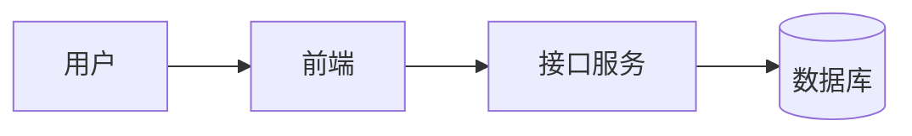

# 工程项目名称

## 项目简介

这个项目解决什么问题？面向谁？最终交付什么？

## 技术栈

- 前端：
- 后端：
- 数据库：
- 部署：

## 架构设计

用简洁语言描述模块关系、数据流和关键边界。



## 功能清单

- [ ] 功能一
- [ ] 功能二
- [ ] 功能三

## 关键实现

记录核心实现、重要配置和关键代码片段。

```ts
export function example() {
  return 'hello'
}
```

## 部署方式

```bash
npm install
npm run build
```

## 问题记录

| 问题 | 原因 | 解决方案 |
| --- | --- | --- |
| 示例问题 | 示例原因 | 示例方案 |

## 后续计划

- 下一步一
- 下一步二
- 下一步三
